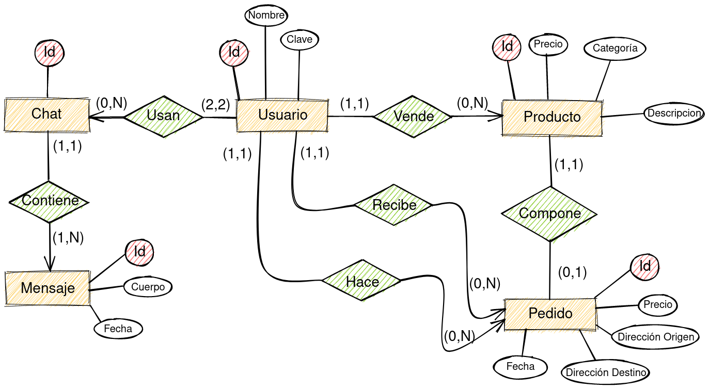

# Proyecto Marketplace (nombre en proceso)
Aplicación de compraventa de productos.

Parte privada: gestión de tus productos, comunicarte con otros usuarios y comprar productos.Los usuarios administradores podrán gestionar todos los productos y usuarios.

Parte pública: darte de alta, login, ver productos.

# Modelo Entidad-Relación

# Servicios internos 
- Generar una factura en PDF
- Generar el historial de los envíos en PDF
- Envío de correos como notificacion.

# Integrantes del grupo
Nombre | Apellidos | Correo | Github 
--- | --- | --- | --- 
Miguel | Santiago Herrero | m.santiagohe@alumnos.urjc.es | msantiagocsb
Diego | Díaz Pérez | d.diazp@alumnos.urjc.es | didushow
Oscar | Nydza Nicpoñ | o.nydza.2017@alumnos.urjc.es | nipsn
