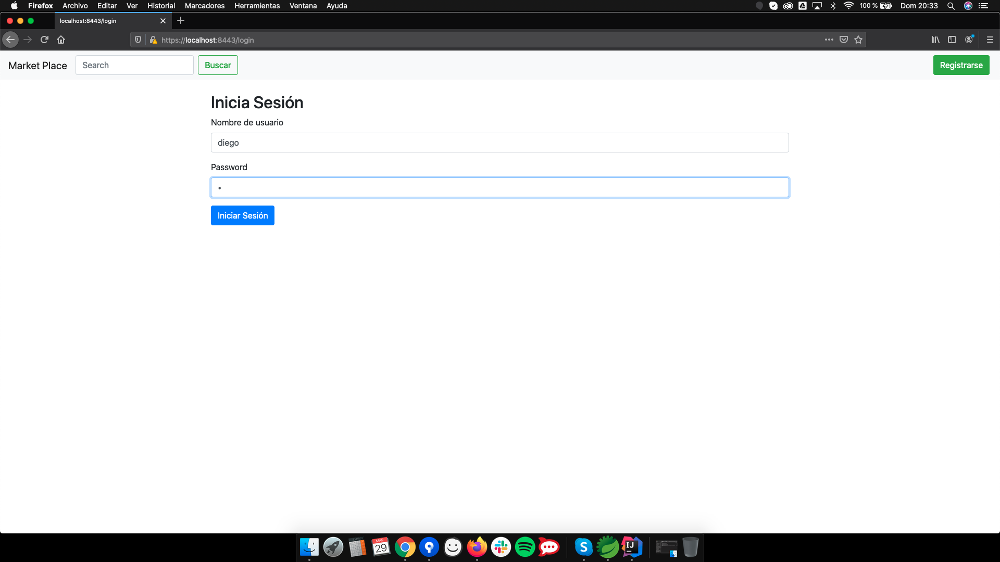
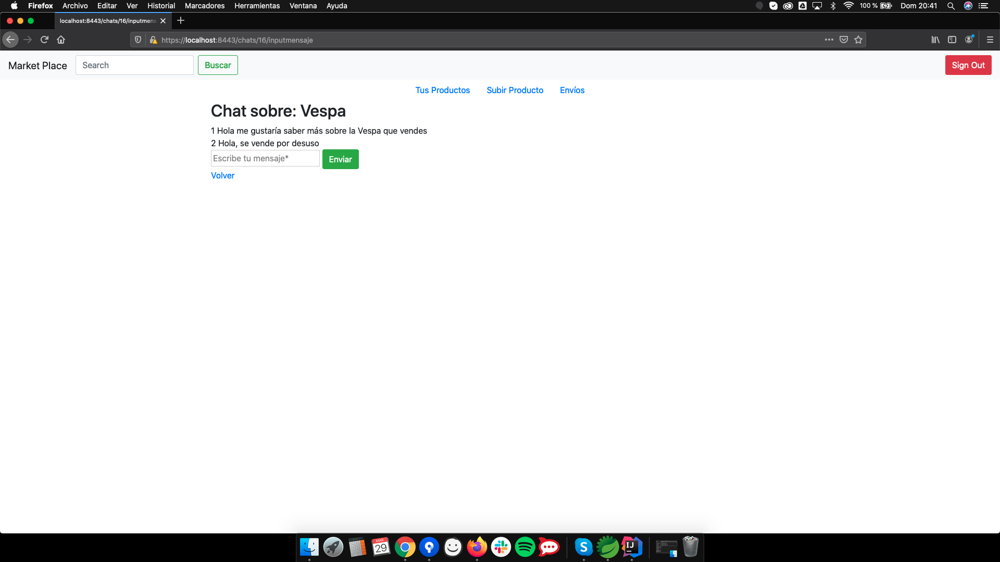

# Proyecto Marketplace (nombre en proceso)
Aplicación de compraventa de productos.

Parte privada: gestión de tus productos, comunicarte con otros usuarios y comprar productos.Los usuarios administradores podrán gestionar todos los productos y usuarios.

Parte pública: darte de alta, login, ver productos.

# Despliegue
Se ha hecho el despliegue en Ubuntu Server 18.04, y para ello se han seguido los siguientes pasos:
### 1: Instalación de los paquetes necesarios
Se debe instalar tanto MySQL como java. Para ello se puede hacer todo con un solo comando:

`sudo apt install mysql-server openjdk-8-jre-headless openjdk-8-jdk git`

### 2: Inicialización y creación de la base de datos:
Se debe inicializar el servicio de `mysql` y crear la base de datos en si, además de crear un usuario y darle permisos sobre ella.
Iniciamos el servicio con: 

`sudo systemctl enable mysql`
`sudo systemctl start mysql`

Se crean la base de datos y el usuario siguiendo la documentación oficial:

https://spring.io/guides/gs/accessing-data-mysql/

Para que funcione correctamente el nombre de la base de datos debe ser `db_marketplace_sec`, el usuario debe ser `admin@localhost` y su contraseña `rooturjc`.

### 3: Ejecución
Para ello nos descargamos el proyecto con:

`git clone https://github.com/nipsn/ProyectoDAD`

En la carpeta `executables` hay 3 archivos `.jar` que se deberán ejecutar cada uno en una `tty`. En nuestro caso, la aplicación principal (`demo-0.0.1-SNAPSHOT.jar`) en la `tty0`, el servicio interno encargado de la creación de facturas (`pdfgen.jar`) en la `tty1` y el servicio interno que gestiona los correos electrónicos (`sender-emails-source.jar`) en la `tty2`.

Para ejecutar cada uno de ellos se usa el comando `java -jar ejecutable.jar`, donde `ejecutable.jar` corresponde a cada uno de los ejecutables.

# Modelo Entidad-Relación

# Diagrama UML

# Servicios internos 
**Generar una factura en PDF**

<kbd></kbd>

**Envío de correos como notificacion**

<kbd></kbd>

 ## Pantallas de la aplicación
Se especifican los wireframes de las principales pantallas de Gym Tool

**Diagrama de Flujo de Pantalla**

**Diagrama de Flujo de Pantalla FINAL**

Diagrama de flujo resultante para la primera fase del desarrollo

**Pantalla Inicial**

<kbd></kbd>

**Pantalla de Producto**

<kbd></kbd>

**Pantalla de Perfil del Usuario**

<kbd></kbd>

**Pantalla de Registrarse**

<kbd></kbd>

**Lista de usuarios**

<kbd></kbd>

**Pantalla de Iniciar Sesión**

<kbd></kbd>

**Pantalla de Chat sobre Producto**

<kbd></kbd>

**Pantalla de Lista de chats**

<kbd></kbd>

**Pantalla de Gestión de Productos del Usuario**

<kbd></kbd>

**Pantalla de Subir un Producto**

<kbd></kbd>

# Integrantes del grupo
Nombre | Apellidos | Correo | Github 
--- | --- | --- | --- 
Miguel | Santiago Herrero | m.santiagohe@alumnos.urjc.es | msantiagocsb
Diego | Díaz Pérez | d.diazp@alumnos.urjc.es | didushow
Oscar | Nydza Nicpoñ | o.nydza.2017@alumnos.urjc.es | nipsn
