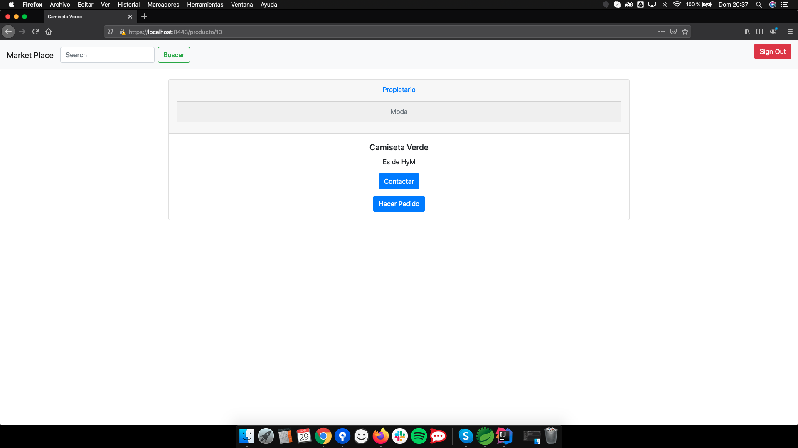
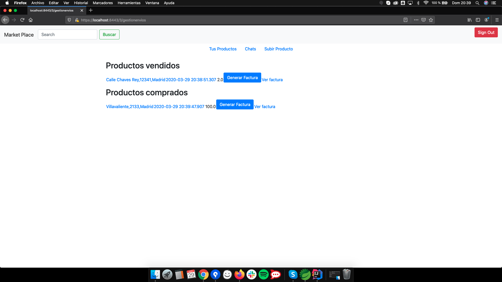
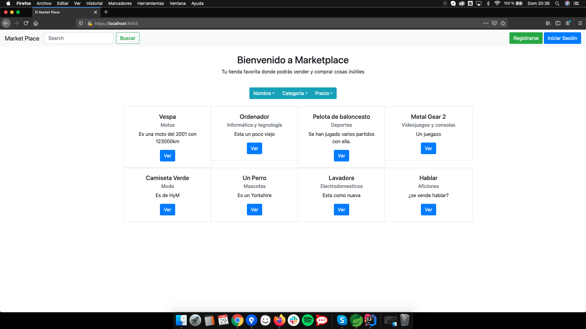

# Proyecto Marketplace (nombre en proceso)
Aplicación de compraventa de productos.

Parte privada: gestión de tus productos, comunicarte con otros usuarios y comprar productos.Los usuarios administradores podrán gestionar todos los productos y usuarios.

Parte pública: darte de alta, login, ver productos.

# Modelo Entidad-Relación

# Servicios internos 
- Generar una factura en PDF
- Generar el historial de los envíos en PDF
- Envío de correos como notificacion.

 ## Pantallas de la aplicación
Se especifican los wireframes de las principales pantallas de Gym Tool

**Diagrama de Flujo de Pantalla**

**Diagrama de Flujo de Pantalla FINAL**

Diagrama de flujo resultante para la primera fase del desarrollo

**Pantalla Inicial**

<kbd></kbd>

**Concepto Pantalla Inicial**

<kbd></kbd>

**Pantalla de Búsqueda de Producto**

<kbd></kbd>

**Pantalla de Producto**

<kbd></kbd>

**Concepto Pantalla de Producto**

<kbd></kbd>

**Pantalla de Perfil del Usuario**

<kbd></kbd>

**Concepto Pantalla de Perfil del Usuario**

<kbd></kbd>

**Pantalla de Registrarse**

<kbd></kbd>

**Concepto Pantalla de Registrarse**

<kbd></kbd>

**Concepto Pantalla de lista de usuarios**

<kbd></kbd>

**Pantalla de Iniciar Sesión**

<kbd></kbd>

**Concepto Pantalla de Iniciar Sesió**

<kbd></kbd>

**Pantalla de Chat sobre Producto**

<kbd></kbd>

**Concepto Pantalla de Chat sobre Producto**

<kbd></kbd>

**Concepto Pantalla de lista de chats**

<kbd></kbd>

**Pantalla de Productos Favoritos**

<kbd></kbd>

**Pantalla de Gestión de Productos del Usuario**

<kbd></kbd>

**Concepto Pantalla de Gestión de Productos del Usuario**

<kbd></kbd>

**Pantalla de Subir un Producto**

<kbd></kbd>

**Concepto de Pantalla Subir un Producto**

<kbd></kbd>

**Concepto Pantalla de lista Productos**

<kbd></kbd>

# Integrantes del grupo
Nombre | Apellidos | Correo | Github 
--- | --- | --- | --- 
Miguel | Santiago Herrero | m.santiagohe@alumnos.urjc.es | msantiagocsb
Diego | Díaz Pérez | d.diazp@alumnos.urjc.es | didushow
Oscar | Nydza Nicpoñ | o.nydza.2017@alumnos.urjc.es | nipsn
